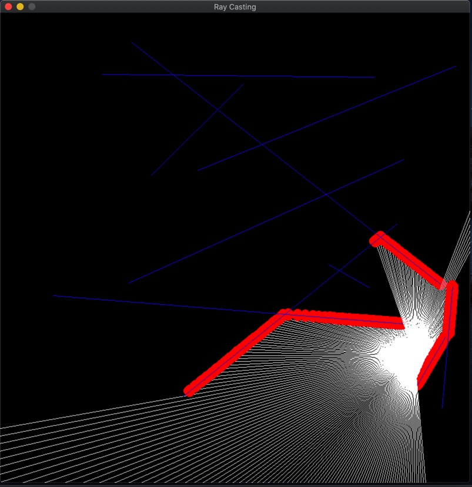

# Casting A Light Source With Rays
> This is a small project which I then used to create my 3D ray casting project [here](https://github.com/twinksy1/3D-ray-casting). The point of this project was to familiarize myself with the behavior of rays in a 2D environment. Here rays shine out all the way until they hit a wall, the blue lines, and draws a red dot on each ray intersection.

# Building
* SDL2 developer library needs to be installed
	* **Linux**: *sudo apt-get install libsdl2-dev*
	* **Windows**: [Tutorial](https://www.matsson.com/prog/sdl2-mingw-w64-tutorial.php)
---
Then in cloned directory:
* **Build**: *make*
---
# Screenshots

